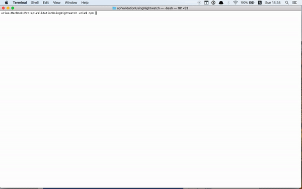

[](https://travis-ci.org/dexmac/api-validation-with-nightwatch)
[](https://raw.githubusercontent.com/dexmac/api-validation-with-nightwatch/master/LICENSE)

**Table of Contents**

- [Project Intro](#Intro)
- [Install](#Install)
- [Run](#Run)
- [Usage](#Usage)
- [Contribute](#Contribute)
- [Misc.](#Misc.)

<a name="Intro"></a>

# Intro

# Validating APIs using NightwatchJS

NightwatchJS is a great tool for web-application end-to-end automation.

Every web application deals with many outgoing requests & incoming responses, 
whether it be by making AJAX requests or by downloading resources. 
Thus, when performing end-to-end testing it is very beneficial to validate if outgoing requests conform to pre-set APIs.

But how can we make sure that a request was made and that it conforms to a specific protocol? 
Come [NightwatchJS assertions](#custom-nightwatch-assertions) to the rescue…

Common methods for testing APIs in E2E tests involve setting up mock-servers or using network sniffing tools.
When testing with Nighwatch however, it makes sense to use Nightwatch itself (via [performance.timing](#Supported Browsers))

An existing Nightwatch assertion [exists on Github](https://github.com/aedile/nightwatch-analytics/blob/master/tests/assertions/hasRequest.js) and validates that the parameters of a request exist. 
The current assertion is a rewrite, which improves the above assertion by adding regular expression testing for validation of each of the request parameters.

The demo project includes an example of navigating to Google.com, performing a search for 'NightwatchJS' 
and validating if the search URL sent to Google's servers contains the string, as well as other parameters.
It also includes an example of how to setup NightwatchJS for use with Travis.CI, to run the tests on both Linux and Mac machines remotely.

For more detailed instructions on how the assertion can be used inside your own NightwatchJS project please see the [Usage](#usage) section below.



# Install
   - clone the repository
   - `npm install`
   
# Run

To run the demo project, inside the root directory, run:
## `npm test`

On a Mac, this should automatically run the Selenium server, the Chrome Webdriver and initiate Nightwatch. 
(based on their locations in the `nightwatch.json` config.) as well as open Chrome with the tests/google.js test scenario.

## Usage

1. Validate NightwatchJS's custom assertions directory and custom commands directory location inside your nightwatch.json configuration file: (e.g., "custom_assertions_path" : "tests/e2e/assertions", "custom_commands_path" : "tests/e2e/commands").

2. Place the custom assertion file inside the custom assertions directory. And the custom command file inside the commands directory.

3. We can now define our expected URLs in our fixtures by using our [page-object module](https://github.com/nightwatchjs/nightwatch/wiki/Page-Object-API) or, perhaps, define our URLs as constants / plain-strings
and start using the assertion in our nightwatchJS tests like so: 

```javascript
  'test' : function(browser) {
    var requestParameters = {
      "param1" : "value1",
      "param2" : "value2"
    };
  
    browser.assert.hasRequest('https://some.request.url', requestParameters);
  }
```

The final URL to validate that is asserted will therefore be: `https://some.request.url/?param1=value1&param2=value2`
and incase the exact URL and parameters exist the assertion will be true.

4. Specific parameter values (e.g., value1 & value2 above) can also be replaced with regular expressions, 
to enable wildcards and “fuzzy comparison”, e.g.:

```javascript
'test' : function(browser) {
    var requestParameters = {
      "param1" : ".*",
      "param2" : "val.*"
    };
  
    browser.assert.hasRequest('https://some.request.url', requestParameters);
  }
```

In which case even a URL such as: `https://some.request.url/?param1=ANYVALUE&param2=val123` will pass the assertion.

*Note* - this assertion can also be used to inspect resources downloaded on the page (e.g., external CSS, images, external sources, etc.), however the main use would most likely be testing APIs - therefore it is aptly named 'hasRequest'.

<a name="Contribute"></a>

## Contribute
For contribution guidelines, see [Contributing](./CONTRIBUTING.md).

## Misc.
- [Custom Nightwatch Assertions](#custom-nightwatch-assertions)
- [Stack](#stack)
- [Supported Browsers](#supported-browsers)
- [Folder Structure](#folder-structure)

## Custom Nightwatch Assertions

NightwatchJS contains a nifty feature that allows enhancing and customizing its basic set of test assertions 
(- more info. on creating and configuring custom assertions can be found [here](https://tudorbarbu.ninja/custom-assertions-for-nightwatchjs/) 
and [here](https://github.com/nightwatchjs/nightwatch-docs/blob/master/guide/extending-nightwatch/custom-assertions.md)).

## Stack

- `npm` - For package management
- `nightwatch` - [NightwatchJS](http://nightwatchjs.org/)
- `selenium-server` - Controls the Selenium standalone server automatically in a separate child process; 
- `chromedriver` - For communicating with the Chrome browser
    
## Supported Browsers

Nightwatch supports all major browsers through the use of browser-specific webdrivers, adhering to the Selenium API,
however, the read-only access to the outgoing / incoming requests and resources is performed by the [Performance API](https://developer.mozilla.org/en-US/docs/Web/API/Performance),
and namely `performance.timing`. [Many more interesting measurements](http://kaaes.github.io/timing/info.html) can be measured using performance.timing,
however, we're mostly interested in the actual URL of the resource / request. 
Any outgoing (and incoming) URL should be found under the this object.
Having said that, requests that return with server error responses, connection issues, DNS lookup failures, etc. will [not be included]([https://github.com/w3c/resource-timing/issues/12]).
*Note* Another thing which is important to note is that Apple only just recently **re**-added support for the performance API in Safari, in iOS 11.2 so bear in mind that the assertions will work good in Chrome and most Android 4.4 and up browsers, but will be missing on previous iOS versions above 8 and below 11.2.

For a detailed compatibility table for the features please see: [Performance API browser support](https://caniuse.com/#feat=resource-timing)

## Folder Structure

```
apiValidationUsingNightwatch/
  README.md - This file
  package.json - Npm modules and project version
  node_modules/ - Created after initial 'npm install'
  package.json - Npm modules and package version
  tests/ 
      google.js - the demo test
  pages/
      google.js - page object definitions (selectors, main URL, etc.)
  commands/ 
    getRequests.js - Nighwatch command which runs the performance.timing API
  assertions/
    hasRequest.js - The custom Nightwatch assertion to validate a request's API
```
